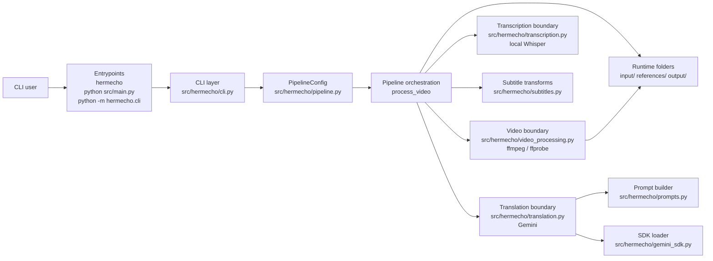
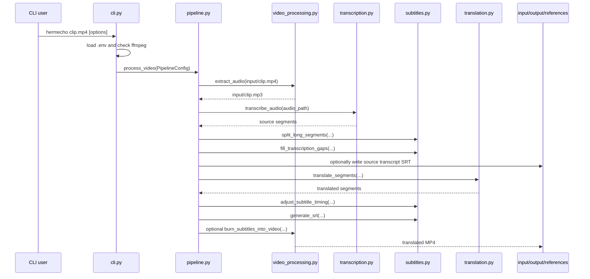
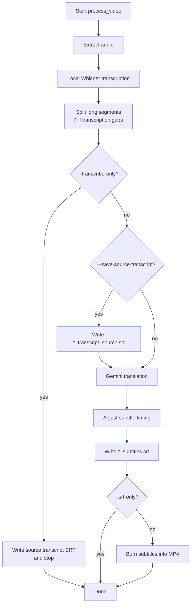
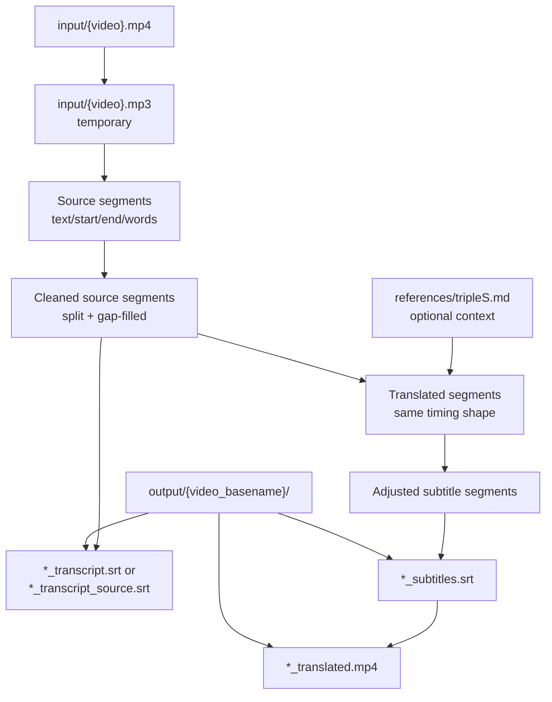
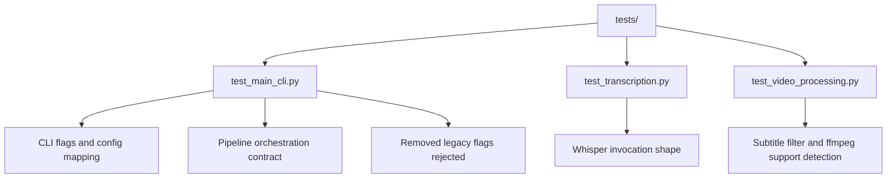
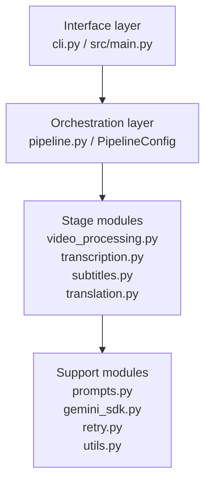

# Hermecho Repository Architecture Lecture Notes

_Last verified: 2026-05-03_

These notes explain Hermecho the same way you might explain it in a short engineering lecture: start from the system map, walk the pipeline in execution order, then connect each runtime stage back to the file that owns it.

The structure intentionally mirrors the teaching style of `anamnesis/docs/pipeline-overview.md`: system map first, stage walkthroughs next, then artifacts, boundaries, and operational notes.

## Learning Objectives

After reading this note, you should be able to:

1. Describe Hermecho as a staged media-processing pipeline.
2. Trace a CLI command to the exact module that executes each stage.
3. Explain the main internal data shape: subtitle segment dictionaries.
4. Know which module to edit for transcription, translation, subtitle timing, SRT output, or video burn-in changes.
5. Run the relevant tests and understand what they protect.

## What Hermecho Does

Hermecho translates Korean-audio videos into Traditional Chinese (Taiwan) subtitles. It uses local Whisper for transcription, Gemini for translation, writes timestamped SRT files, and can hard-burn subtitles into an MP4 (`README.md:1-3`).

Current supported behavior includes local Whisper transcription, Gemini translation with reference-file context, subtitle guardrails, SRT-only/transcribe-only/full burn-in modes, subtitle styling controls, and `ffmpeg` subtitle-filter detection (`README.md:5-14`).

The current pipeline is intentionally simpler than some older design notes: it does **not** include Gemini multimodal transcription, transcription prompts, keyword extraction, or timing-review stages (`README.md:14`, `tests/test_main_cli.py:123-164`).

## System Map



| File | Main responsibility |
| --- | --- |
| `src/main.py` | Backward-compatible wrapper for `python src/main.py`; delegates to packaged CLI (`src/main.py:1-11`). |
| `src/hermecho/cli.py` | Parses CLI args, loads `.env`, checks `ffmpeg`, converts args into `PipelineConfig`, and calls `process_video` (`src/hermecho/cli.py:13-95`). |
| `src/hermecho/pipeline.py` | Owns the end-to-end stage order and mode branching (`src/hermecho/pipeline.py:23-170`). |
| `src/hermecho/transcription.py` | Runs local OpenAI Whisper with word timestamps (`src/hermecho/transcription.py:8-56`). |
| `src/hermecho/translation.py` | Calls Gemini, chunks segments, parses strict JSON responses, logs token usage, and retries transient failures (`src/hermecho/translation.py:16-31`, `src/hermecho/translation.py:96-220`). |
| `src/hermecho/prompts.py` | Builds the strict JSON translation prompt with previous/next context and optional reference material (`src/hermecho/prompts.py:8-70`). |
| `src/hermecho/subtitles.py` | Splits long segments, fills transcription gaps, adjusts subtitle timing, and writes SRT files (`src/hermecho/subtitles.py:67-214`). |
| `src/hermecho/video_processing.py` | Extracts MP3 audio from video, checks `ffmpeg` subtitle support, builds subtitle style filters, and burns subtitles into MP4 (`src/hermecho/video_processing.py:19-39`, `src/hermecho/video_processing.py:90-220`). |
| `src/hermecho/gemini_sdk.py` | Lazily imports `google-genai` and raises a helpful install error (`src/hermecho/gemini_sdk.py:10-24`). |
| `src/hermecho/retry.py` | Centralized exponential backoff and transient retry helpers (`src/hermecho/retry.py:19-56`). |
| `src/hermecho/utils.py` | Loads reference files and prints debug segment lists (`src/hermecho/utils.py:8-41`). |

## Repository Structure

The runtime package lives under `src/hermecho/`; `src/main.py` exists only for compatibility (`README.md:107-124`).

```text
hermecho/
├── README.md
├── pyproject.toml
├── requirements.txt
├── src/
│   ├── main.py
│   └── hermecho/
│       ├── __init__.py
│       ├── cli.py
│       ├── pipeline.py
│       ├── transcription.py
│       ├── translation.py
│       ├── prompts.py
│       ├── subtitles.py
│       ├── video_processing.py
│       ├── gemini_sdk.py
│       ├── retry.py
│       └── utils.py
├── tests/
│   ├── conftest.py
│   ├── test_main_cli.py
│   ├── test_transcription.py
│   └── test_video_processing.py
├── input/        # source media
├── output/       # generated timestamped outputs
├── references/   # glossary/context files
└── docs/         # local design notes; ignored by Git in this repo
```

## Full Pipeline

The README summarizes the full pipeline as:

```text
extract audio -> local Whisper transcription -> split/fill segments -> Gemini translation -> timing adjustment -> SRT -> optional MP4 burn-in
```

That summary maps directly to `process_video()` (`README.md:78-82`, `src/hermecho/pipeline.py:64-170`).



| Step | Function | What it does |
| --- | --- | --- |
| CLI parse | `parse_args` in `src/hermecho/cli.py` | Defines runtime modes, model/language settings, input/output locations, reference file, subtitle styling, and cooldown options (`src/hermecho/cli.py:13-79`). |
| Config assembly | `config_from_args` in `src/hermecho/cli.py` | Converts parsed args into `PipelineConfig` (`src/hermecho/cli.py:82-84`). |
| Preflight | `main` in `src/hermecho/cli.py` | Loads `.env`, checks `ffmpeg`, then calls the pipeline (`src/hermecho/cli.py:87-95`). |
| Stage setup | `PipelineConfig` and `process_video` in `src/hermecho/pipeline.py` | Holds defaults and selects the number of stages based on mode (`src/hermecho/pipeline.py:23-68`). |
| Audio extraction | `extract_audio` in `src/hermecho/video_processing.py` | Uses `ffmpeg` to create an MP3 next to the source video (`src/hermecho/video_processing.py:90-134`). |
| Transcription | `transcribe_audio` in `src/hermecho/transcription.py` | Loads local Whisper and transcribes with word timestamps (`src/hermecho/transcription.py:22-52`). |
| Segment shaping | `split_long_segments`, `fill_transcription_gaps` | Splits long cues and inserts placeholders for large silence gaps (`src/hermecho/subtitles.py:67-171`). |
| Reference load | `load_reference_material` in `src/hermecho/utils.py` | Reads optional glossary/context text for Gemini (`src/hermecho/utils.py:8-28`). |
| Translation | `translate_segments` / chunk helpers in `src/hermecho/translation.py` | Sends segment chunks to Gemini and extracts one translation per input index (`src/hermecho/translation.py:16-31`, `src/hermecho/translation.py:96-220`). |
| Timing adjustment | `adjust_subtitle_timing` in `src/hermecho/subtitles.py` | Extends/shortens cue end times to maintain a buffer before the next cue (`src/hermecho/subtitles.py:174-214`). |
| SRT output | `generate_srt` in `src/hermecho/subtitles.py` | Writes subtitle files into the output run directory (`src/hermecho/pipeline.py:143-145`). |
| MP4 burn-in | `burn_subtitles_into_video` in `src/hermecho/video_processing.py` | Uses `ffmpeg` subtitles filter and ASS style options to render subtitles into video (`src/hermecho/video_processing.py:140-220`). |
| Cleanup | `finally` block in `process_video` | Removes the temporary extracted MP3 (`src/hermecho/pipeline.py:168-170`). |

## Mode Branches

Hermecho has one main pipeline with three important branch points.



| Mode | User command | Pipeline behavior |
| --- | --- | --- |
| Transcribe only | `hermecho clip.mp4 --transcribe-only` | Writes source-language transcript SRT and skips translation/burn-in (`README.md:69-75`, `src/hermecho/pipeline.py:109-114`). |
| SRT only | `hermecho clip.mp4 --srt-only` | Runs transcription and translation, writes translated SRT, skips MP4 burn-in (`README.md:69-75`, `src/hermecho/pipeline.py:147-149`). |
| Save source transcript | `hermecho clip.mp4 --save-source-transcript` | During translated runs, also writes a source-language SRT before translation (`README.md:69-75`, `src/hermecho/pipeline.py:118-123`). |
| Full pipeline | `hermecho clip.mp4` | Runs all stages and writes a translated MP4 when translation succeeds (`src/hermecho/pipeline.py:125-166`). |

## Data and Artifact Flow



| Artifact | Created by | Used by |
| --- | --- | --- |
| `input/<video>.mp4` | User places media under `input/` or passes `--input_dir` (`README.md:57-59`). | `extract_audio`. |
| `input/<video>.mp3` | `extract_audio` creates this temporary file next to the video (`src/hermecho/video_processing.py:106-118`). | `transcribe_audio`; removed in pipeline cleanup (`src/hermecho/pipeline.py:168-170`). |
| Segment dictionaries | Whisper and subtitle transforms. | Translation, timing adjustment, and SRT generation. |
| `references/tripleS.md` or custom file | Maintainer/user reference material. | Loaded by `load_reference_material`, inserted into Gemini prompt when present (`src/hermecho/utils.py:8-28`, `src/hermecho/prompts.py:53-57`). |
| `output/<video_basename>/*_transcript*.srt` | `generate_srt` during transcribe-only or save-source-transcript paths (`src/hermecho/pipeline.py:109-123`). | Human review/debugging/source reference. |
| `output/<video_basename>/*_subtitles.srt` | `generate_srt` after translation/timing adjustment (`src/hermecho/pipeline.py:143-145`). | Final subtitle artifact and burn-in input. |
| `output/<video_basename>/*_translated.mp4` | `burn_subtitles_into_video` (`src/hermecho/pipeline.py:150-166`). | Final hard-subtitled video. |

Outputs are timestamped under `output/<video_basename>/` (`README.md:105`, `src/hermecho/pipeline.py:104-107`).

## Internal Data Shape: Subtitle Segments

The most important internal contract is the segment dictionary. Most pipeline stages pass around lists of dictionaries with at least:

```python
{
    "start": 0.0,
    "end": 1.0,
    "text": "subtitle text"
}
```

Whisper-generated segments may also include word-level timestamps under `words`. `split_long_segments()` uses those word timestamps when available, and falls back to proportional text splitting when they are absent (`src/hermecho/subtitles.py:67-126`).

This data shape lets Hermecho preserve timing while changing text:

1. Whisper creates source-language segments.
2. Subtitle transforms keep/adjust `start` and `end`.
3. Gemini returns translated text for the same segment indexes.
4. SRT generation serializes the final list into subtitle blocks.

## External Boundary Reference

| Boundary | Module/function | External dependency | Failure style |
| --- | --- | --- | --- |
| Local executable | `is_ffmpeg_installed`, `extract_audio`, `burn_subtitles_into_video` in `video_processing.py` | `ffmpeg` and `ffprobe` (`src/hermecho/video_processing.py:76-87`, `src/hermecho/video_processing.py:90-134`). | Prints user-facing error and returns `None`/stops the stage. |
| Subtitle rendering support | `_ffmpeg_supports_subtitles_filter` | `ffmpeg -filters` must include `subtitles` / libass (`README.md:18-21`, `src/hermecho/video_processing.py:19-39`). | Burn-in is skipped with explanatory error. |
| Local ASR | `transcribe_audio` | Python `whisper` package and model files (`src/hermecho/transcription.py:22-38`). | Returns `None` for runtime/missing-file errors; returns `[]` for no segments. |
| Gemini API | `_make_gemini_client`, `_translate_chunk` | `GEMINI_API_KEY` and `google-genai` (`README.md:45-49`, `src/hermecho/translation.py:25-31`, `src/hermecho/gemini_sdk.py:10-24`). | Retries chunk translation and returns fallback failure state. |
| Prompt format | `build_translation_prompt` | Gemini instruction following; strict JSON shape (`src/hermecho/prompts.py:21-70`). | Translation parser attempts robust extraction, then retries/fails chunk. |

## Testing Map



| Test file | What it protects |
| --- | --- |
| `tests/test_main_cli.py` | Removed legacy flags stay rejected, default args map to `PipelineConfig`, `src/main.py` delegates to package CLI, and orchestration calls Whisper/timing/SRT stages as expected (`tests/test_main_cli.py:13-65`, `tests/test_main_cli.py:68-164`). |
| `tests/test_transcription.py` | Missing audio returns `None`, Whisper receives the intended options, prompt-related legacy options are not passed, and empty Whisper output returns `[]` (`tests/test_transcription.py:11-69`). |
| `tests/test_video_processing.py` | Subtitle style escaping, subtitles filter construction, and `ffmpeg` subtitles-filter detection (`tests/test_video_processing.py:15-61`). |

Run tests from repo root:

```bash
PYTHONPATH=src python -m pytest tests/ -v
```

or, in the project Conda environment:

```bash
conda run -n hermecho python -m pytest tests/ -q
```

## Where to Make Common Changes

| Goal | Start here | Why |
| --- | --- | --- |
| Add/change a CLI option | `src/hermecho/cli.py`, then `PipelineConfig` in `src/hermecho/pipeline.py` | CLI args must flow into the runtime config. |
| Change stage ordering or mode behavior | `src/hermecho/pipeline.py` | `process_video()` is the orchestrator. |
| Tune Whisper behavior | `src/hermecho/transcription.py` | Owns `whisper.load_model()` and `model.transcribe()` options. |
| Tune Gemini translation behavior | `src/hermecho/translation.py` and `src/hermecho/prompts.py` | Translation request, parsing, chunking, and prompt rules live there. |
| Change subtitle splitting/gap/timing/SRT formatting | `src/hermecho/subtitles.py` | Owns segment cleanup and SRT generation. |
| Change burn-in styling or ffmpeg behavior | `src/hermecho/video_processing.py` | Owns filter construction, capability checks, and ffmpeg commands. |
| Add retry policy shared by more API calls | `src/hermecho/retry.py` | Central place for backoff behavior. |
| Add/update architecture tests | `tests/test_main_cli.py`, `tests/test_transcription.py`, `tests/test_video_processing.py` | Existing tests are organized by boundary. |

## Operational Notes

- Python package metadata and the `hermecho` console script are defined in `pyproject.toml` (`pyproject.toml:5-29`).
- `.env` should hold `GEMINI_API_KEY`; secrets should not be committed (`README.md:45-49`).
- `ffmpeg` must be installed and include the `subtitles` filter for burn-in (`README.md:18-21`, `README.md:51-55`).
- Runtime inputs belong in `input/`, generated outputs go under `output/`, and reference context belongs under `references/` (`README.md:57-59`, `README.md:95`, `README.md:105`).
- `docs/` is intended for local design notes and implementation plans; durable user-facing docs should go in `README.md` when they affect setup, commands, or behavior (`README.md:107-125`).

## Quick Mental Model

Think of Hermecho as four layers:



The shortest explanation is:

> Hermecho is a CLI-driven pipeline. `cli.py` turns user options into `PipelineConfig`; `pipeline.py` runs each stage; stage modules isolate external tools and transformations; segment dictionaries carry subtitle text and timing from Whisper through Gemini to SRT/MP4 output.
